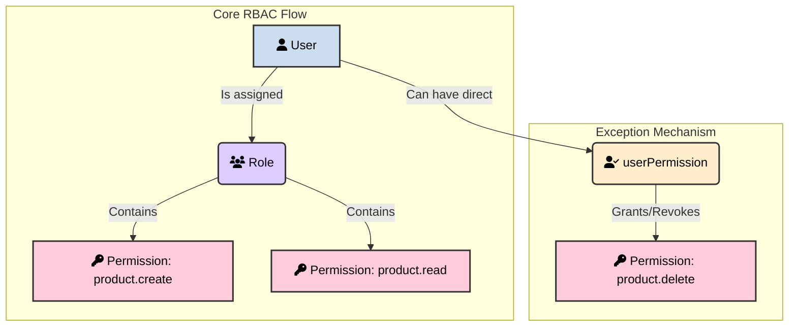

# Roles and Permissions: Define Who Can See and Do What

The `data-primals-engine` implements a robust Role-Based Access Control (RBAC) system to manage user authorizations. This system relies on two core models: `role` and `permission`, allowing for granular control over what users can access and perform within the platform.

## Understanding the RBAC Flow

The core idea is to assign **Roles** to your **Users**. Each **Role** is a collection of specific **Permissions**. This makes managing rights scalable and easy to understand.



## How to Set Up Permissions: A Step-by-Step Guide

Here is a practical guide to setting up your access control using API calls.

### Step 1: Define Your Permissions

A **Permission** defines a specific action. The engine uses a clear naming convention for API access, including explicit denials (`NOT_`) which override broader permissions:
-   `API_ADD_DATA`: Allows creating data in *any* model.
-   `API_ADD_DATA_product`: Allows creating data *only* in the `product` model.
-   `API_ADD_DATA_NOT_user`: Explicitly denies creating data in the `user` model, even if `API_ADD_DATA` is granted.
-   `API_SEARCH_DATA`: Allows reading data from *any* model.
-   `API_SEARCH_DATA_NOT_user`: Explicitly denies searching data in the `user` model.
-   `API_EDIT_DATA_order`: Allows editing data *only* in the `order` model.
-   `API_EDIT_DATA_NOT_user`: Explicitly denies editing data in the `user` model.
-   `API_DELETE_DATA`: Allows deleting data from *any* model.
-   `API_DELETE_DATA_NOT_user`: Explicitly denies deleting data in the `user` model.
-   `API_ADMIN`: A super-permission that grants all rights.

**Example: Creating permissions for a "Product Manager"**

```javascript
await insertData('permission', [
  // General permission to view products
  { name: 'API_SEARCH_DATA_product', description: 'Allows viewing all products.' },
  // Permission to create new products
  { name: 'API_ADD_DATA_product', description: 'Allows creating new products.' },
  // Permission to edit ONLY products they own
  {
    name: 'API_EDIT_DATA_product',
    description: 'Allows editing of one\'s own products.',
    filter: { "$eq": ["$createdBy", "{user._id}"] } // Dynamic filter
  }
]);
```

### Step 2: Create Roles and Assign Permissions

A **Role** is a collection of permissions. Instead of assigning dozens of individual permissions to each user, you assign them a role.

**Example: Creating the "Product Manager" role**

We use the `$link` operator to associate the permissions we created in the previous step.

```javascript
await insertData('role', {
  name: 'Product Manager',
  permissions: {
    "$link": {
      // Find permissions whose name is in the following list
      "$in": ["$name", [
        "API_SEARCH_DATA_product",
        "API_ADD_DATA_product",
        "API_EDIT_DATA_product"
      ]],
      "_model": "permission" // Specify the model to search in
    }
  }
});
```

### Step 3: Assign a Role to a User

Finally, you assign the newly created role to a user by updating their `roles` field.

**Example: Making "John Doe" a Product Manager**

```javascript
await editData('user', 
  { username: 'john.doe' }, // Filter to find the user
  {
    // Use $link to find the role by its name
    roles: { "$link": { "name": "Product Manager", "_model": "role" } }
  }
);
```

Now, `john.doe` has all the permissions defined in the "Product Manager" role.

## Advanced: Exceptions with `userPermission`

Sometimes, you need to grant or revoke a specific permission for a single user without creating a whole new role. The `userPermission` model is perfect for this.

### Key Fields of the `userPermission` Model

| Attribute | Type | Description |
|:---|:---|:---|
| **`user`** | relation to `user` | The user for whom the exception applies. |
| **`permission`** | relation to `permission` | The specific permission being granted or revoked. |
| **`isGranted`** | boolean | `true` to grant the permission, `false` to explicitly revoke it. |
| **`expiresAt`** | datetime | If set, the exception is temporary and will automatically expire. |

**Example: Temporarily grant "John Doe" the right to delete products for 24 hours.**

```javascript
// First, ensure the 'API_DELETE_DATA_product' permission exists
await insertData('permission', {
  name: 'API_DELETE_DATA_product',
  description: 'Allows deleting products.'
});

// Now, create the temporary exception
const expirationDate = new Date();
expirationDate.setDate(expirationDate.getDate() + 1); // Expires tomorrow

await insertData('userPermission', {
  user: { "$link": { "username": "john.doe", "_model": "user" } },
  permission: { "$link": { "name": "API_DELETE_DATA_product", "_model": "permission" } },
  isGranted: true,
  expiresAt: expirationDate.toISOString()
});
```

This comprehensive RBAC system ensures that your application remains secure and that users only have access to the functionalities and data they are authorized to use.

**[Next: Automation with Workflows](automation-workflows)**