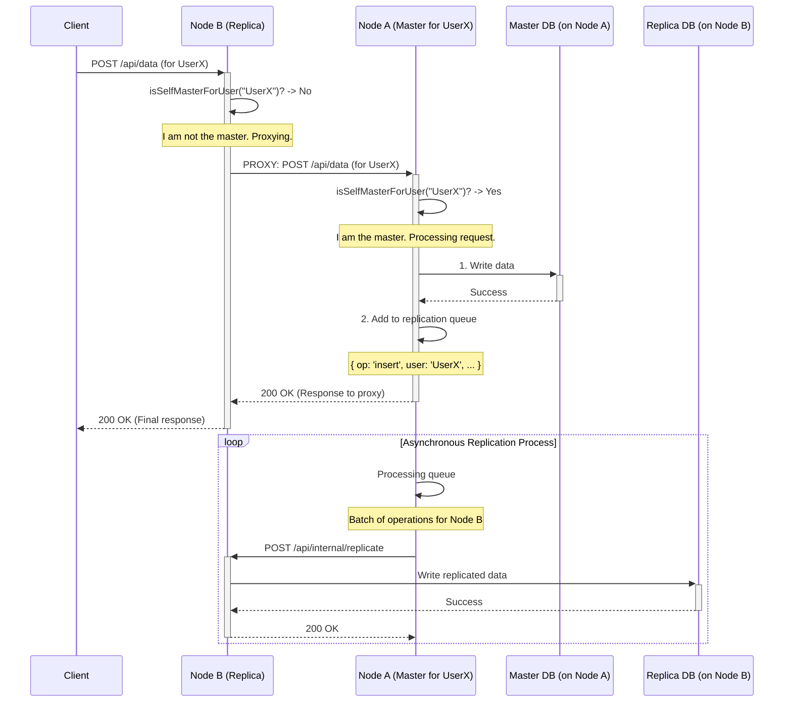

# Sharding & Replication: Scalability and High Availability

The `data-primals-engine` integrates a sharding and replication system designed to ensure horizontal scalability and high availability of user data. This mechanism distributes data and requests across a cluster of nodes, ensuring the system remains performant and resilient as the load increases.

## Fundamental Concepts

The architecture is based on several key concepts:

1.  **User-Based Sharding**: The basic principle is that all data belonging to a specific user is primarily stored on a single node, designated as their "master" node. This greatly simplifies data consistency and query logic.

2.  **Consistent Hashing**: To determine which node is the "master" for a given user, the system uses a consistent hashing algorithm based on the `username`. To ensure a balanced distribution of users across the cluster's nodes, even if nodes are added or removed, the system uses **virtual nodes** (vnodes). Each physical node is represented by multiple points on the hash ring, which smooths out data distribution.

3.  **Lease-Based Mastership**: To avoid "split-brain" situations (where two nodes think they are the master for the same user), the system uses a lease mechanism based on MongoDB. The node designated by the hash must periodically acquire and renew a "lease" (a locked document in the database) to confirm its master status. If a node cannot renew its lease, it stops acting as the master, ensuring that only one master is active at any given time.

4.  **Asynchronous Replication**: Write operations (create, update, delete) are first validated on the master node. Once the operation is successful, it is added to a replication queue. A background process then sends these operations in batches to the "replica" nodes designated for that user, thus ensuring data redundancy.

5.  **Smart Replica Selection**: The number of replicas is defined by a replication factor (default is 1 master + 1 replica). Nodes eligible to be a replica are chosen in a "greedy" manner: the system selects the healthy nodes with the most free disk space, thereby promoting a balanced storage load.

6.  **Gossip Protocol**: The cluster's nodes communicate with each other via a "gossip" protocol. Periodically, each node randomly contacts another node to exchange information about the state of other cluster members (status `UP`, `SUSPECT`, `DOWN`, disk space, etc.). This allows each node to have an up-to-date view of the cluster topology without requiring a central coordinator.

## Request Flow

Request routing is managed intelligently to optimize performance and resilience.

### Write Operations (POST, PUT, DELETE)

1.  A node receives a write request for a user.
2.  It determines which node is the master for that user.
3.  If the current node is not the master, it relays (proxies) the request to the correct master node.
4.  The master node executes the operation on its local database.
5.  Once the operation is successful, it adds it to a queue for asynchronous replication to the replica nodes.
6.  It returns a success response to the client without waiting for the replication to complete.

### Read Operations (GET)

1.  A node receives a read request.
2.  It determines the list of responsible nodes for the user (the master first, then the replicas).
3.  It attempts to relay the request to the first node on the list (the master).
4.  **In case of failure** (timeout, network error), it automatically tries the next node on the list (a replica).
5.  This "failover" process continues until a node responds successfully or all responsible nodes have failed.

This mechanism ensures that reads remain possible even if a user's master node is temporarily unavailable.

## Request Flow Diagram

The diagram below illustrates how a write request is processed in the cluster.



## Fault Tolerance

- **Master Node Failure**: If a master node fails, its lease will expire. Another node (likely a former replica) can then acquire the lease and become the new master for the affected users. Requests will be automatically redirected to this new master.
- **Replica Node Failure**: The gossip protocol will mark the node as `SUSPECT` and then `DOWN`. The replica selection system will choose another healthy node to maintain the replication factor.
- **Split-Brain**: The lease system is the primary defense against this scenario. Only the node holding the lease can perform write operations, thus preventing data from diverging.

## How to Use This Feature

Activating the sharding and replication system requires configuring your application instances to communicate with each other.

### Prerequisites

You need at least two running instances of the `data-primals-engine` application, each with its own database, accessible via a public URL.

### Step 1: Enable the Cluster and Replication Modules

In your main server file (e.g., `server.js`), ensure that the `cluster` and `replication` modules are added to the list of modules to be loaded.

```javascript
import { Config, Engine } from 'data-primals-engine';

// ... other configurations

Config.Set("modules", [
    "mongodb", 
    "data", 
    "user", 
    "cluster",      // <-- Enable the cluster module
    "replication"   // <-- Enable the replication module
    // ... other modules
]);

const app = express();
const engine = await Engine.Create({ app });
engine.start();
```

### Step 2: Configure Peer Discovery

The nodes discover each other via a central discovery endpoint. You must set the `PEERS_ENDPOINT` environment variable in your `.env` file for each node.

```env
PEERS_ENDPOINT=https://my-discovery-service.com/peers.json
```

This endpoint must return a JSON object containing a list of all nodes in the cluster. Each node in the list should have a unique `id` and its public `url`.

**Example `peers.json`:**
```json
{
  "peers": [
    { "id": "node-1", "public_domain": "node1.myapp.com", "sharding": true, "replica": true },
    { "id": "node-2", "public_domain": "node2.myapp.com", "sharding": true, "replica": true },
    { "id": "node-3", "public_domain": "node3.myapp.com", "sharding": true, "replica": true }
  ]
}
```

### Step 3: (Optional) Fine-Tune Configuration

You can adjust the behavior of the cluster by setting the following configuration values:

- **`replicationFactor`**: The total number of copies for each user's data (1 master + N replicas). Default is `2`.
- **`gossipInterval`**: The interval in milliseconds at which nodes exchange state information. Default is `2000` (2 seconds).
- **`gossipSuspectTimeout`**: The time in milliseconds after which a non-responsive node is marked as `DOWN`. Default is `10000` (10 seconds).

**Example in `server.js`:**
```javascript
Config.Set("replicationFactor", 3); // 1 master + 2 replicas
Config.Set("gossipInterval", 5000); // Gossip every 5 seconds
```

Once these steps are completed and your application instances are restarted, they will form a cluster, distribute new user data, and replicate it for high availability.


**[Next: Contributing](CONTRIBUTING.md)**